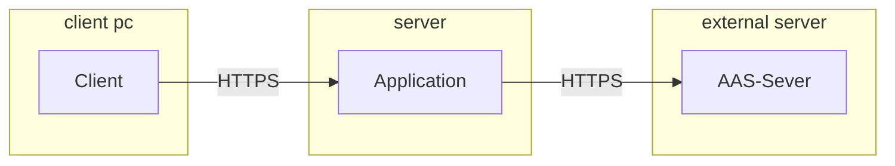
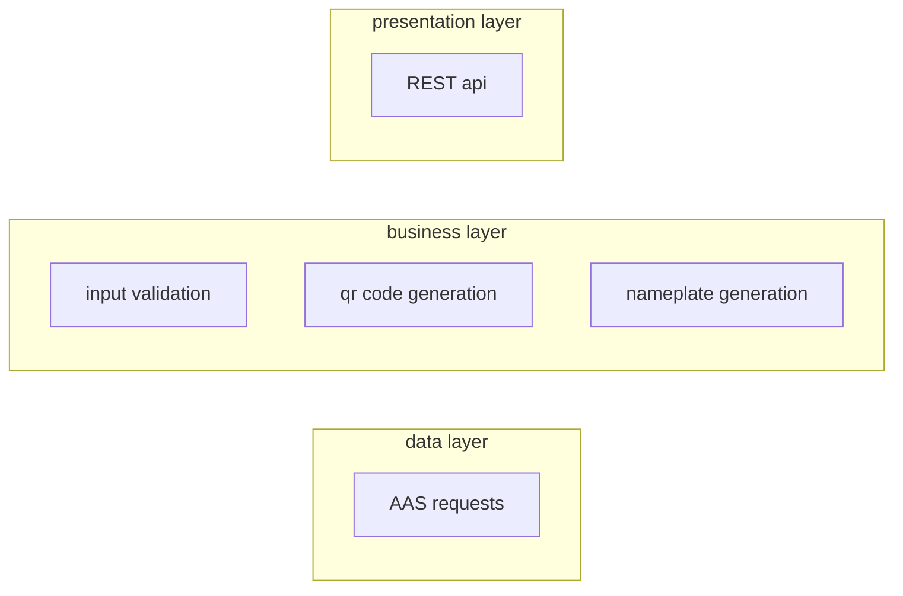

## Version Control

|Version|Date|Author|Comment|
|-----|-----------|------------|---------------------|
|1.0|20.10.2023|Simon Luz|Initialize and create a first draft of the SAS|
|1.1|03.11.2023|Simon Luz|add details and remove unnecessary sections|

## Table of contents
1. [Introduction](#intro)
2. [Scope](#scope)
3. [System Overview](#so)
    - 3.1 [System Environment](#sye)
    - 3.2 [Software Environment](#soe)
4. [Architecture](#ar)
    - 4.1 [Architectural Concept](#arc)
    - 4.2 [Architectural Model](#am)
5. [System design](#sd)
6. [Product Interfaces](#pp)
    - 6.1 [User Interfaces](#ui)
    - 6.3 [Software Interfaces](#si)
    - 6.4 [Communication Interface](#ci)
7. [Subsystem specification](#ss)
    - 7.1 [MOD01 REST api](#71-mod01-web-interface-)
    - 7.2 [MOD02 Data Acquisition](#72-mod02-data-acquisition-)
    - 7.3 [MOD03 Nameplate generation](#73-mod03-nameplate-generation-)
8. [Technical Concept](#tc)
    - 8.1 [REST api](#spa)
    - 8.2 [Modularization](#cbd)
    - 8.3 [Deployment](#d)
    - 8.4 [Data validation](#dv)
    - 8.5 [Exception handling](#eh)
9. [References](#ref)

## 1 Introduction 

The purpose of this document is to provide a detailed description of the software architecture for the digital nameplate generator by focusing on four key quality attributes: Maintainability, performance, compatibility and reliability. These attributes were selected from the ISO/IEC 25010 quality model based on their importance in the design and development of the application

## 2 Scope 

The digital nameplate generator creates nameplates for assets managed in an Asset Administration Shell, also known as “AAS”. Assets eligible for a nameplate, contain a section of data that describes the most important aspects of the asset including but not limited to information about the manufacturer, serial number, year of production and product markings. An AAS Server can be accessed via a REST-API to obtain the stored data.\
A application shall be created that can generate a digital nameplate according to the DIN standard . The user shall provide the AAS data directly or as a reference to an AAS Server. The application shall be able to fetch AAS data from given reference

## 3 System Overview 

## 3.1 System Environment 

The application shall be implemented as server application. Services are Provided over Hypertext Transfer Protocol (Secure) (HTTPS). Therefore the application server shall be reacheble from the internet. A connection to an AAS Server is also needed, as a refernece to AAS Data can be provided, wich shall be fetched via the REST-API provided by a separate AAS-Server.

## 3.2 Software Environment 

The application shall be developed with the programming Language JAVASCRIPT and the framework NODEJS.\
\

## 4 Architecture 

## 4.1 Architectural Concept 

*Figure 4.1: Client Model Deployment Diagram*

The main objective of this project is a server application, serving a nameplate generator with a REST API. The application will be build with JAVASCRIPT and NODEJS. The client shall access the REST API over HTTPS. Asset data will be provided by the user with the request to the API in JavaScript Object Notation (JSON) or as URL as referece to AAS data.

## 4.2 Architectural Model 

*Figure 4.2:  Layered Architecture Diagram*

The layered architecture diagram illustrates the logical architecture which describe the technical processes based on the system objectives and the user’s requirements. The presentation layer is responsible for any interaction between the user and the software. It provides the REST API to provide access to the application and it's functionality. The business layer contains objects that execute the business processes. It is the result of the project’s objectives. To get the information needed by the business layer, the persistence layer contains the AAS-Server requests to fetch the needed AAS Data from an external AAS Server.

## 5 System design 

The following model 5.1 illustrates the technical architecture which outlines the implementation of the logical architecture. It provides a reference model for the implementation of the system in terms of components, classes and data storage. The figure is a class diagram of the system design. The diagram depicts the classes the system shall contain as well as their connections to each other. Components that only serve a design function are omitted from this diagram to not clutter it. Below the figure, a table containing the class name, a short description of its function is provided to further explain the diagram.

*Figure 5.1: UI class diagram*

|Class name|Description|
|-----|--------------------|
|Endpoints|The root of the application. It contains the methods responsible for receiving requests and sending the computed answers|
|Formatchecker|checks the given input for errors and missing data. Is responsible for rejecting malformed requests|
|AasFetcher|fetches AAS Data for a given reference. Used when the user request contains no AAS data, but a reference to AAS data|
|NamePlateGenrator|renders a nameplate for given AAS data|
|QRCodeGEnerator|renders a QR code for given AAS data| 

## 6 Product Interfaces 

## 6.1 User Interface 

A REST interface providing controll over the application shall be provided. It shall be consistent in naming and parameters, making it mor usable. Needed Data shall be provided as input when needed. Output shall be in a common format. The interface shall follow the REST API spec and shall be describable as openAPI spec.

## 6.3 Software Interface 

The application shall developed SPRING BOOT as framework. For additional functionality, libraries from the SPRING project shall be preferred.\
Interfaces between modules shall be designed as public Methods providing the functionality of the module. In the case of a circular dependency between modules, a interface must be introduced to reverse the dependency and enforce decoupling of modules. Auxiliary Methods must be used to keep Methods short and abstract functionality. Auxiliary Methods must not be accessible from other modules.

## 6.4 Communication Interface 

The communication architecture abides the client-server model thus employing a REST-compliant web service. The system shall use HTTP(S) for communication.

## 7 Subsystem specification 

## 7.1 MOD01 REST Api 

|Subsystem specification ID|MOD01|
|-------------|--------------------|
|System requirements covered|
FR.001
 
FR.002
 
FR.003 
 
FR.006
 
NFR.001
 
NFR.002
 
NFR.003
 |
|Service|The rest api provides the restpoints for generating nameplates with given AAS data. the parameters of the endpoints include all needed data to generate a template. Endpoints for transferring AAS data directly and with a reference to AAS data shall be included.|
|Module documentation|[MOD01 REST api](MOD01-REST-Api)|

## 7.2 MOD02 Data Acquisition 

|Subsystem specification ID|MOD02|
|-------------|--------------------|
|System requirements covered|
FR.003
 
FR.006
 
NFR.002
 
NFR.003

NfR.004
 |
|Service|The application must request all asset data form an AAS-Server using its REST-API interface. The different datasets needed for the application to work are implemented in this module. On request the server sends more data than necessary to generate a digital nameplate. Therefore, the raw data from the server must be filtered and checked for completeness and errors to allow further processing in the generation of the nameplate and display of the data.|
|Module documentation|[MOD02 Data Acquisition](MOD02-Data-Acquisition)|

## 7.3 MOD03 Nameplate generation 

|Subsystem specification ID|MOD03|
|-------------|--------------------|
|System requirements covered|
FR.003
 
FR.004
 
FR.005
 
FR.006
 
NFR.002
 
NFR.003
 
NFR.004
 |
|Service|It generates a nameplate corresponding to the DIN standard . It contains general Information, warning signs, certificates and a QR-code.|
|Module documentation|[MOD03 Nameplate Generation](MOD03-Nameplate-Generation)|

## 8 Technical Concept 

## 8.1 REST  api

The application shall provide a REST api. The endpoints of the api shall be stateless. With the same input, they shall provide the same output, independent of the application state.

## 8.2 Modularization 

JAVASCRIPT allows an application to be divided in multiple Modules. This shall be used to divide the application in independent modules with a specific use. The modules shall be loosely coupled, allowing replacement with out changes to other modules. Circular dependencies must be resolved as described in the interface chapter. To enforce modularization and loose coupling, Modules must hide internal details and must only provide general Methods to other Modules.
 
## 8.3 Deployment 

The compiled project shall be hosted on a http(s) server, providing a JAVASCRIPT Runtime Environment.

## 8.4 Data validation 

The data is refined by structuring and filtering it. If a nameplate is generated while information is missing the user is notified about an incomplete nameplate. Data Validation must check received data for completeness and possible errors. Data validation shall provide a boolean result, marking received data as usable or not usable for further processing.

## 8.5 Exception handling 

To prevent errors by user input, user input is validated before it is processed. If an error occurs i.e., because the AAS-Server does not respond or the requested data contains errors, the user will be notified about the problem

## 9 References 

[1] 	ISO25000, „ISO/IEC 25010,“ [Online]. Available: https://iso25000.com/index.php/en/iso-25000-standards/iso-25010. [ Accessed on 01.10.2022].\
[2] 	DIN, „DIN VDE V 0170-100 VDE V 0170-100:2021-02 Digitales Typenschild - Teil 100: Digitale Produktkennzeichnung,“ 02. 2021. [Online]. Available: https://www.vde-verlag.de/normen/0100615/din-vde-v-0170-100-vde-v-0170-100-2021-02.html. [ Accessed on 01.10.2022].\
[3] 	geeksforgeeks, „Introduction to Java,“ [Online]. Available: https://www.geeksforgeeks.org/introduction-to-java/. [Accessed on  20.010.2023].
[4] spring, „Overview of Spring Framework,“ [Online]. Available: https://docs.spring.io/spring-framework/docs/5.0.0.RC2/spring-framework-reference/overview.html. [Accessed on  20.010.2023].
